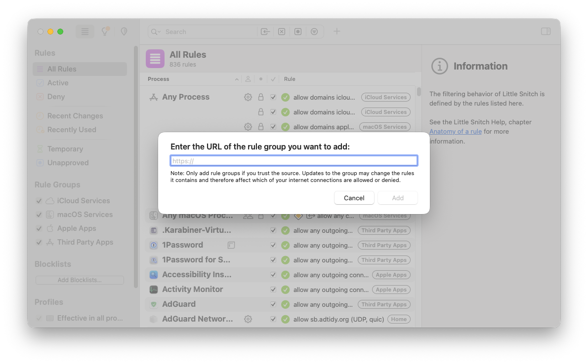

# Little Snitch Rule Groups

When using Little Snitch for the first time, every connection outside the built-in rule groups that come with the default install (such as iCloud and macOS Services) will trigger a prompt to allow or deny it. This can become overwhelming, especially on new installations.

Rule groups allows for rules to be shared by enabling subscriptions. This repository contains a number of rules for several popular macOS applications.

## Usage

To subscribe to one of the rules available, open Little Snitch Configuration.app and go to `File > New Remote Rule Group (⇧⌘M)`. On GitHub, click on the desired rule and hit `Download`. This will redirect you to a page (e.g. [All Rules](http://raw.githubusercontent.com/ucomesdag/little-snitch-rules/master/rules/all.lsrules)) which you can use directly as the input of the rule subscription URL.



## Generating Rules

The repository includes a Python script, `generate_little_snitch_rules.py`, that generates the rule files from the current Little Snitch configuration. It uses the existing rules for metadata and grouping while keeping the current Little Snitch configuration as the source of truth.

Run it from the repository root:

```
./generate_little_snitch_rules.py --rules-dir ./rules
```

The generated rule files are written to output/, including the `all.lsrules`.


## License

MIT
